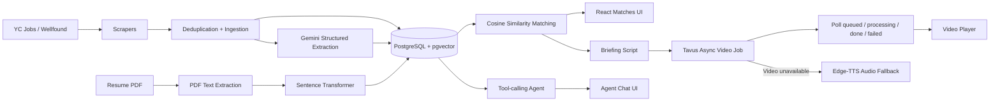

# NEXUS

NEXUS is a full-stack career intelligence application that scrapes job listings from the web, converts messy listings into structured data, semantically matches them against a user's resume, exposes an AI agent over the user's saved data, and generates a short avatar video briefing for the top matches.

## Current Status

The core pipeline is working end to end:

- Scraping from two structurally different sources: Y Combinator Jobs and Wellfound
- Pagination support
- Deduplication across scraper reruns
- LLM-based structured extraction with Pydantic validation and caching
- PDF resume upload and text extraction
- Local sentence-transformer embeddings
- PostgreSQL + pgvector cosine similarity matching
- Free-text semantic search
- LLM-generated one-line match explanations
- Tool-calling career agent
- Email/password authentication with hashed passwords and JWT
- User-specific shortlist and briefing history
- Asynchronous Tavus avatar video briefing
- Edge-TTS audio fallback when video generation is unavailable
- Handling for Gemini rate limits, temporary model failures, and malformed structured output

Bonus features are still being added. See **Unfinished / Planned Work** below.

---

## Tech Stack

### Frontend
- React
- Vite
- JavaScript
- CSS

### Backend
- FastAPI
- SQLAlchemy
- Pydantic
- PyJWT
- pwdlib / Argon2

### Database
- PostgreSQL
- Supabase
- pgvector

### Scraping
- requests
- BeautifulSoup
- robots.txt checks
- rate limiting
- retry handling

### AI / ML
- Google Gemini
- sentence-transformers
- `all-MiniLM-L6-v2`
- 384-dimensional embeddings

### Video / Voice
- Tavus
- Edge-TTS fallback

---

## Architecture



### High-level flow

1. Public job pages are scraped from Y Combinator Jobs and Wellfound.
2. Raw listings are normalized, deduplicated and stored.
3. Gemini converts each listing into a fixed structured schema.
4. The structured output is validated with Pydantic and cached.
5. A user uploads a resume PDF.
6. Resume and job text are embedded using a local sentence-transformer model.
7. PostgreSQL + pgvector ranks jobs using cosine similarity.
8. Gemini generates a short explanation for each match.
9. The user can semantically search jobs using natural-language concepts such as `backend infra`.
10. The agent queries the database using defined tools instead of receiving a full database dump in its prompt.
11. The briefing flow generates a short script, submits it to Tavus, stores the provider job ID, and polls asynchronously until the video is ready.
12. If video generation is unavailable, NEXUS falls back to Edge-TTS audio.

---

## Project Structure

```text
nexus/
├── backend/
│   ├── app/
│   │   ├── api/
│   │   │   └── routes/
│   │   ├── core/
│   │   ├── db/
│   │   ├── schemas/
│   │   ├── services/
│   │   │   └── scraper/
│   │   └── utils/
│   ├── migrations/
│   ├── scripts/
│   │   └── scrape_jobs.py
│   ├── requirements.txt
│   └── .env
│
├── frontend/
│   ├── src/
│   │   ├── api/
│   │   ├── components/
│   │   └── pages/
│   └── package.json
│
└── README.md
```

---

## Database

NEXUS uses PostgreSQL with the `vector` extension enabled.

Important entities include:

- `users`
- `resumes`
- `jobs`
- `matches`
- `shortlists`
- `briefings`
- `extraction_cache`
- `scrape_runs`
- `job_changes`
- `notifications`
- `api_costs`

The current embedding dimension is **384**, matching `all-MiniLM-L6-v2`.

---

## Deduplication Strategy

Re-running the scraper should not create duplicate jobs.

NEXUS creates a stable `dedup_key` using:

1. `source + external_id` when the source provides a stable external ID.
2. A normalized source URL as the fallback.

URLs are normalized before use so tracking parameters do not create false duplicates.

A separate content hash is created from the raw listing text.

On a scraper rerun:

- If the deduplication key is new, a new job is inserted.
- If the key already exists and the content is unchanged, the existing record is reused and `last_seen_at` is updated.
- If the same job changed, the stored job is updated and the content change can be recorded.
- The job embedding is cleared when content changes so it can be regenerated from the new text.

This makes scraper reruns idempotent while still allowing listing updates to be detected.

---

## LLM Structured Extraction

Each raw listing is converted into this fixed schema:

```json
{
  "title": "string",
  "company": "string | null",
  "location": "string | null",
  "remote_ok": "boolean | null",
  "stipend": "string | null",
  "required_skills": [],
  "experience_level": "string | null",
  "deadline": "date | null"
}
```

The response is validated with Pydantic before being written to the job record.

### Failure handling

The extraction pipeline handles:

- malformed structured output
- temporary Gemini `503` responses
- Gemini `429` rate limits
- model-specific failures
- empty responses

The configured Gemini model is tried first, followed by fallback models when appropriate.

Only valid structured output is cached.

### Extraction cache

The raw job text is hashed. If the same listing content has already been successfully extracted, the cached structured result is reused instead of making another LLM call.

---

## Semantic Matching

NEXUS uses the local model:

```text
sentence-transformers/all-MiniLM-L6-v2
```

The model produces 384-dimensional normalized embeddings.

Resume and job embeddings are stored in PostgreSQL using pgvector.

Matches are ranked using cosine similarity.

The displayed score is a **semantic similarity score**, not a probability of getting hired.

### Semantic search

Free-text semantic search is also supported.

For example, a query such as:

```text
backend infra
```

can retrieve jobs containing related concepts such as:

```text
distributed systems
Go
Kubernetes
```

even if the exact words `backend infra` do not appear in the listing.

---

## Agent

The career agent uses Gemini function/tool calling.

It does not receive all database rows inside one large prompt.

The model can call defined backend tools such as:

- getting the user's top matches
- searching jobs
- reading the user's shortlist
- getting details for a specific job

All user-specific database operations are scoped using the authenticated user's ID.

---

## Video Briefing

The **Generate My Briefing** flow summarizes the user's top three semantic matches.

Pipeline:

```text
Top 3 matches
    ↓
60-90 second script
    ↓
Tavus video API
    ↓
provider job ID stored
    ↓
queued
    ↓
processing
    ↓
done / failed
    ↓
video URL stored and played in the app
```

The request that starts video generation does not wait for rendering to finish.

The frontend polls the backend, while the backend checks Tavus for the latest state.

If Tavus video generation is unavailable, NEXUS can generate an Edge-TTS audio briefing instead.

---

## Authentication and Multi-tenancy

NEXUS uses email/password authentication.

Passwords are hashed using Argon2 and are never stored as plaintext.

JWTs are used for authenticated API requests.

Private resources are filtered by the authenticated user on the backend, including:

- resumes
- matches
- shortlist entries
- briefings

Changing an ID in a request must not allow one user to read another user's private data.

Job listings themselves are public scraped data.

---

## Local Setup

### 1. Clone the repository

```bash
git clone https://github.com/AFEEFAMT/nexus-career-agent.git
cd nexus-career-agent
```

### 2. Backend setup

```bash
cd backend
python -m venv venv
```

Windows PowerShell:

```powershell
Set-ExecutionPolicy -Scope Process -ExecutionPolicy RemoteSigned
.\venv\Scripts\Activate.ps1
```

macOS / Linux:

```bash
source venv/bin/activate
```

Install dependencies:

```bash
pip install -r requirements.txt
```

### 3. Configure environment variables

Create:

```text
backend/.env
```

Example:

```env
DB_HOST=your_postgres_host
DB_PORT=5432
DB_NAME=postgres
DB_USER=your_postgres_user
DB_PASSWORD=your_postgres_password

GEMINI_API_KEY=your_gemini_api_key
GEMINI_MODEL=your_supported_gemini_model

JWT_SECRET_KEY=replace_with_a_long_random_secret
JWT_ALGORITHM=HS256
JWT_EXPIRE_MINUTES=1440

TAVUS_API_KEY=your_tavus_api_key
TAVUS_REPLICA_ID=your_tavus_face_or_replica_id

EDGE_TTS_VOICE=en-US-AriaNeural

FRONTEND_ORIGIN=http://localhost:5173
```

Never commit `.env`.

### 4. Enable pgvector

The PostgreSQL database must have the `vector` extension enabled:

```sql
CREATE EXTENSION IF NOT EXISTS vector;
```

### 5. Run database migrations

From `backend/`:

```bash
alembic upgrade head
```

### 6. Populate jobs from the two public sources

From `backend/`, run the scraper pipeline:

```bash
python -m scripts.scrape_jobs --source all --max-jobs 10 --max-pages 2
```

This command scrapes Y Combinator Jobs and Wellfound, deduplicates and stores the listings, generates missing job embeddings, and runs structured extraction.

The limits are intentionally small by default for a local/demo run. They can be changed with `--max-jobs` and `--max-pages`.

If a free Gemini model is temporarily rate-limited or unavailable, the scraper/ingestion work is still persisted and the extraction layer reports the failure instead of crashing the application.

### 7. Start the backend

```bash
uvicorn app.main:app --reload
```

Backend:

```text
http://127.0.0.1:8000
```

### 8. Frontend setup

Open another terminal:

```bash
cd frontend
npm install
npm run dev
```

Frontend:

```text
http://localhost:5173
```

---

## Main User Flow

1. Register or log in.
2. Upload a PDF resume.
3. Generate semantic matches.
4. Generate AI match explanations.
5. Search jobs using semantic free-text search.
6. Add useful jobs to the shortlist.
7. Ask the agent questions about saved jobs and matches.
8. Generate an avatar career briefing for the top matches.
9. Revisit saved jobs, match scores and previous briefings from the shortlist view.

---

## Robustness / Failure Cases

The application currently handles several failure cases encountered during development:

- scraper retries for network failures
- polite delays between scraper requests
- robots.txt checks
- duplicate listings on scraper reruns
- malformed Gemini structured output
- Gemini 429 rate limiting
- Gemini 503 / temporary high-demand failures
- fallback Gemini models for extraction
- invalid PDF uploads
- Tavus asynchronous job states
- Tavus failed/unavailable video generation
- Edge-TTS audio fallback
- empty match / shortlist / briefing states
- authenticated ownership checks for private resources

---

## Unfinished / Planned Work

The following bonus items are not complete yet:

- scheduled automatic scraper runs
- automatic user notifications when a saved listing changes or is removed
- token and INR cost dashboard
- extraction evaluation script using hand-labelled samples
- public deployment

These are bonus features. The current core application runs locally end to end.

---

## Notes

- Free API/model tiers can return temporary rate limits or availability errors.
- The extraction layer uses validation, caching and model fallback rather than trusting raw LLM output.
- Tavus video generation is asynchronous and may take several minutes.
- The generated match percentage represents semantic similarity, not hiring probability.

---

## Author

**Afeefa M T**  
IIT Madras
